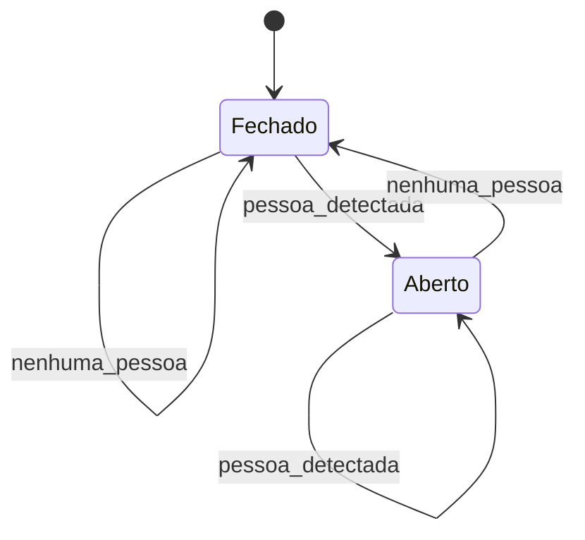
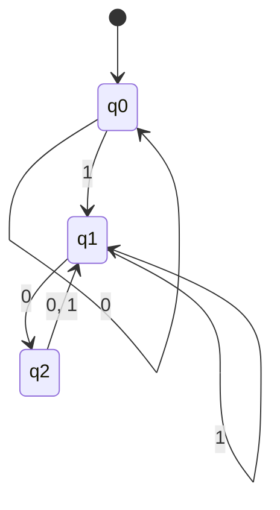
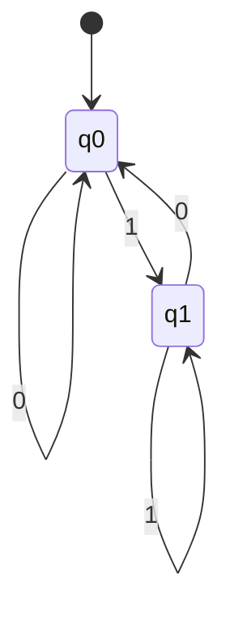
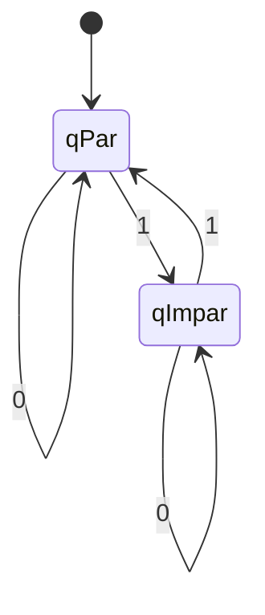
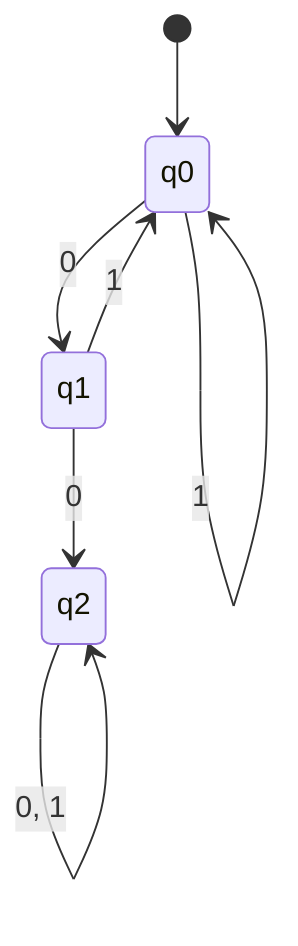
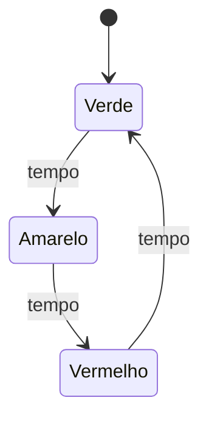
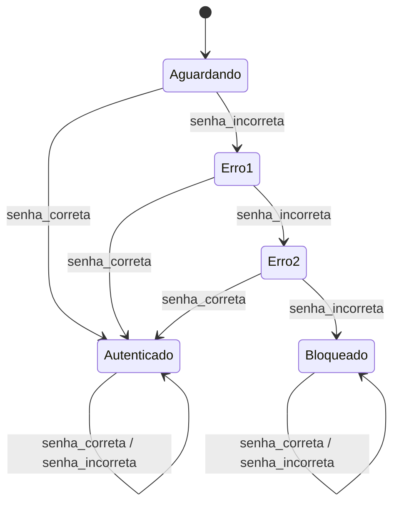
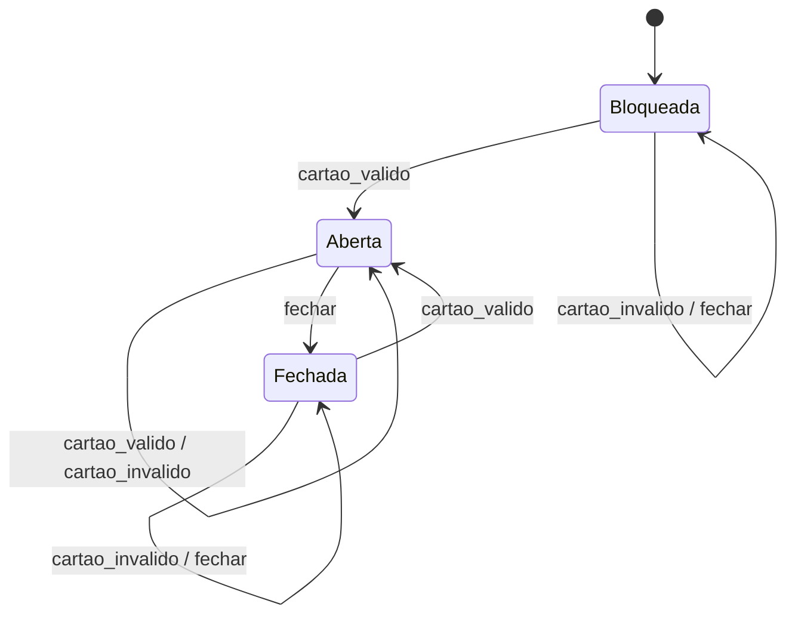
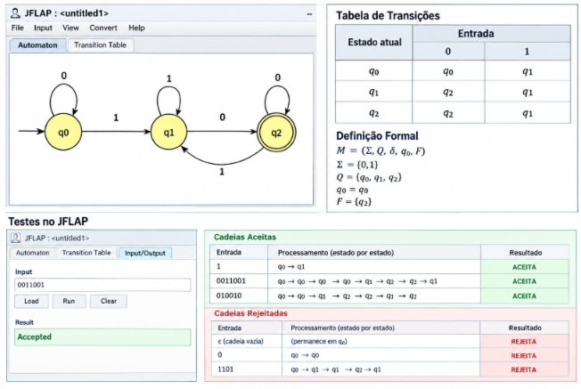

# Lista de Exercícios — Autômatos Finitos Determinísticos (AFD)

> **Disciplina:** Teoria das Linguagens e Autômatos
> **Tema:** Autômatos Finitos Determinísticos
> **Modalidade:** Atividade prática em grupo
> **Objetivo:** identificar, interpretar, construir e testar AFDs.

---

## Identificação do grupo

| Campo        | Preenchimento |
| ------------ | ------------- |
| Turma        | N1     |
| Data         | 08/09/2026    |
| Integrante 1 | Jaiza Michelle Moreira de Carvalho     |


## Orientações

* Registre o raciocínio utilizado em cada resposta.
* Nos exercícios com cadeias, apresente o caminho percorrido estado por estado.
* Nos exercícios de construção, entregue a quíntupla, a tabela de transição e o diagrama.
* Use `ε` para representar a cadeia vazia.
* Quando solicitado, implemente e teste o autômato no JFLAP.

---

# Parte 1 — Fundamentos

## Exercício 1 — Entendendo um autômato finito

Uma lâmpada controlada por um interruptor possui os estados `Desligado` e `Ligado`. Sempre que o botão é pressionado, ocorre a mudança:

```text
Desligado --pressionar--> Ligado

Ligado    --pressionar--> Desligado
```

Responda:

1. Quantos estados existem? **Existem 2 estados: `Desligado` e `Ligado`.**

2. Qual é o estado inicial, considerando que a lâmpada começa apagada? **O estado inicial é `Desligado`.**

3. Qual entrada provoca uma transição? **A entrada `pressionar` provoca uma transição.**

4. Partindo de `Desligado`, qual será o estado após um acionamento? **Após um acionamento, o estado será `Ligado`.**

5. Partindo de `Desligado`, qual será o estado após dois acionamentos? **Após dois acionamentos, o estado será `Desligado`.**

6. Explique o funcionamento do sistema com suas palavras. **O sistema possui dois estados e funciona alternando entre eles sempre que o botão é pressionado. Se a lâmpada estiver desligada, o acionamento a coloca no estado ligado. Se estiver ligada, o acionamento a coloca no estado desligado.**

## Exercício 2 — Porta automática

Uma porta automática possui os estados `Fechado` e `Aberto`. O sensor identifica `pessoa_detectada` ou `nenhuma_pessoa`. Quando uma pessoa é detectada, a porta deve ficar aberta; quando ninguém é detectado, deve ficar fechada.

Complete a tabela:

| Estado atual | Entrada          | Próximo estado |
| ------------ | ---------------- | -------------- |
| Fechado      | pessoa_detectada | Aberto         |
| Fechado      | nenhuma_pessoa   | Fechado        |
| Aberto       | pessoa_detectada | Aberto         |
| Aberto       | nenhuma_pessoa   | Fechado        |

Depois, desenhe o diagrama de estados correspondente e indique o estado inicial.

**Estado inicial:** `Fechado`.



**Explicação:** quando o sensor detecta uma pessoa, a porta passa ou permanece no estado `Aberto`. Quando não há ninguém detectado, a porta passa ou permanece no estado `Fechado`.

---

# Parte 2 — Anatomia e definição formal

## Exercício 3 — Identificando os elementos

Considere um AFD com `Σ = {0,1}`, `Q = {q0,q1}`, estado inicial `q0`, estado final `q1` e as transições abaixo:

| δ  | 0  | 1  |
| -- | -- | -- |
| q0 | q0 | q1 |
| q1 | q0 | q1 |

Identifique e explique:

1. o alfabeto `Σ`; **O alfabeto é `Σ = {0,1}`, formado pelos símbolos `0` e `1`.**

2. o conjunto de estados `Q`; **O conjunto de estados é `Q = {q0,q1}`.**

3. o estado inicial; **O estado inicial é `q0`.**

4. o conjunto de estados finais `F`; **O conjunto de estados finais é `F = {q1}`.**

5. os símbolos que podem ser lidos; **Os símbolos que podem ser lidos são `0` e `1`.**

6. o significado do círculo duplo em um diagrama; **O círculo duplo representa um estado final ou estado de aceitação.**

7. o significado da seta sem origem apontando para um estado. **A seta sem origem representa a indicação do estado inicial do autômato.**

## Exercício 4 — A quíntupla do AFD

Um AFD é formalmente representado por:

```text
M = (Σ, Q, δ, q0, F)
```

Complete:

| Elemento | Significado                                                                             |
| -------- | --------------------------------------------------------------------------------------- |
| `Σ`      | Alfabeto de entrada, ou seja, conjunto de símbolos que podem ser lidos pelo autômato.   |
| `Q`      | Conjunto finito de estados do autômato.                                                 |
| `δ`      | Função de transição, que determina para qual estado o autômato vai após ler um símbolo. |
| `q0`     | Estado inicial do autômato.                                                             |
| `F`      | Conjunto de estados finais ou estados de aceitação.                                     |

Explique por que esses cinco elementos são suficientes para definir o funcionamento de um AFD.

**Resposta:** Esses cinco elementos são suficientes porque definem todas as informações necessárias para o funcionamento do AFD: quais símbolos podem ser lidos (`Σ`), quais estados existem (`Q`), como as transições acontecem (`δ`), onde o processamento começa (`q0`) e quais estados representam aceitação (`F`). Como em um AFD cada estado possui exatamente uma transição para cada símbolo do alfabeto, é possível determinar de forma única o próximo estado durante o processamento de qualquer cadeia.

---

# Parte 3 — Tabela de transições e cadeias

## Exercício 5 — Interpretando uma tabela

Considere `Σ = {0,1}`, `Q = {q0,q1,q2}`, estado inicial `q0`, `F = {q1}` e:

| δ  | 0  | 1  |
| -- | -- | -- |
| q0 | q0 | q1 |
| q1 | q2 | q1 |
| q2 | q1 | q1 |

Responda:

1. Qual é o resultado de `δ(q0,0)`? **`q0`**

2. Qual é o resultado de `δ(q0,1)`? **`q1`**

3. Qual é o resultado de `δ(q1,0)`? **`q2`**

4. Qual é o resultado de `δ(q2,1)`? **`q1`**

5. Qual é o estado de aceitação? **O estado de aceitação é `q1`.**

6. Desenhe o diagrama correspondente à tabela.



**Observação:** no diagrama, `q1` deve ser representado como estado final, utilizando círculo duplo no JFLAP.

7. Justifique por que o autômato é determinístico. **O autômato é determinístico porque, para cada estado e para cada símbolo do alfabeto, existe exatamente uma transição possível. Portanto, não há duas escolhas diferentes para a mesma combinação de estado e símbolo.**

## Exercício 6 — Aceita ou rejeita?

Utilize o AFD do Exercício 5. Determine se cada cadeia é aceita ou rejeitada:

```text
a) 1

b) 0011001

c) 010010

d) 1101

e) 000011010
```

Para cada cadeia, registre todas as transições. Exemplo:

```text
Cadeia: 01

q0 --0--> q0

q0 --1--> q1

Estado final: q1

Resultado: ACEITA
```

| Cadeia      | Caminho percorrido                                                                             | Estado final | Resultado     |
| ----------- | ---------------------------------------------------------------------------------------------- | ------------ | ------------- |
| `1`         | `q0 --1--> q1`                                                                                 | `q1`         | **ACEITA**    |
| `0011001`   | `q0 --0--> q0 --0--> q0 --1--> q1 --1--> q1 --0--> q2 --0--> q1 --1--> q1`                     | `q1`         | **ACEITA**    |
| `010010`    | `q0 --0--> q0 --1--> q1 --0--> q2 --0--> q1 --1--> q1 --0--> q2`                               | `q2`         | **REJEITADA** |
| `1101`      | `q0 --1--> q1 --1--> q1 --0--> q2 --1--> q1`                                                   | `q1`         | **ACEITA**    |
| `000011010` | `q0 --0--> q0 --0--> q0 --0--> q0 --0--> q0 --1--> q1 --1--> q1 --0--> q2 --1--> q1 --0--> q2` | `q2`         | **REJEITADA** |

---

# Parte 4 — Construção de AFDs

## Exercício 7 — Cadeias que terminam em `1`

Construa um AFD sobre `Σ = {0,1}` que reconheça todas as cadeias que terminam em `1`.

* Devem ser aceitas: `1`, `01`, `101`, `0001`, `1101`.

* Devem ser rejeitadas: `ε`, `0`, `10`, `100`, `1110`.

Entregue: conjunto de estados, alfabeto, estado inicial, estados finais, tabela, diagrama e teste de pelo menos cinco cadeias.

**Conjunto de estados:** `Q = {q0,q1}`

**Alfabeto:** `Σ = {0,1}`

**Estado inicial:** `q0`

**Estados finais:** `F = {q1}`

**Significado dos estados:**

* `q0`: a cadeia está vazia ou termina em `0`.
* `q1`: a cadeia termina em `1`.

**Tabela de transições:**

| δ  | 0  | 1  |
| -- | -- | -- |
| q0 | q0 | q1 |
| q1 | q0 | q1 |

**Diagrama:**



**Estado final:** `q1`.

**Definição formal:**

```text
M = (Σ, Q, δ, q0, F)

Σ = {0,1}
Q = {q0,q1}
q0 = q0
F = {q1}
```

**Testes:**

| Cadeia | Caminho percorrido                           | Estado final | Resultado     |
| ------ | -------------------------------------------- | ------------ | ------------- |
| `1`    | `q0 --1--> q1`                               | `q1`         | **ACEITA**    |
| `01`   | `q0 --0--> q0 --1--> q1`                     | `q1`         | **ACEITA**    |
| `101`  | `q0 --1--> q1 --0--> q0 --1--> q1`           | `q1`         | **ACEITA**    |
| `0001` | `q0 --0--> q0 --0--> q0 --0--> q0 --1--> q1` | `q1`         | **ACEITA**    |
| `10`   | `q0 --1--> q1 --0--> q0`                     | `q0`         | **REJEITADA** |
| `100`  | `q0 --1--> q1 --0--> q0 --0--> q0`           | `q0`         | **REJEITADA** |
| `1110` | `q0 --1--> q1 --1--> q1 --1--> q1 --0--> q0` | `q0`         | **REJEITADA** |

---

## Exercício 8 — Número par de símbolos `1`

Construa um AFD sobre `Σ = {0,1}` que reconheça cadeias com quantidade par de símbolos `1`.

Analise: `ε`, `0`, `1`, `11`, `101`, `1100` e `10101`.

Apresente a definição formal `M = (Σ, Q, δ, q0, F)`, a tabela, o diagrama e o processamento das cadeias. Lembre-se de que basta controlar duas situações: quantidade par ou ímpar de símbolos `1`.

**Definição formal:**

```text
M = (Σ, Q, δ, q0, F)

Σ = {0,1}
Q = {qPar, qImpar}
q0 = qPar
F = {qPar}
```

**Significado dos estados:**

* `qPar`: quantidade de símbolos `1` lidos até o momento é par.
* `qImpar`: quantidade de símbolos `1` lidos até o momento é ímpar.

**Tabela de transições:**

| δ      | 0      | 1      |
| ------ | ------ | ------ |
| qPar   | qPar   | qImpar |
| qImpar | qImpar | qPar   |

**Diagrama:**



**Processamento das cadeias:**

| Cadeia  | Caminho percorrido                                                       | Estado final | Resultado     |
| ------- | ------------------------------------------------------------------------ | ------------ | ------------- |
| `ε`     | Nenhuma transição; inicia em `qPar`                                      | `qPar`       | **ACEITA**    |
| `0`     | `qPar --0--> qPar`                                                       | `qPar`       | **ACEITA**    |
| `1`     | `qPar --1--> qImpar`                                                     | `qImpar`     | **REJEITADA** |
| `11`    | `qPar --1--> qImpar --1--> qPar`                                         | `qPar`       | **ACEITA**    |
| `101`   | `qPar --1--> qImpar --0--> qImpar --1--> qPar`                           | `qPar`       | **ACEITA**    |
| `1100`  | `qPar --1--> qImpar --1--> qPar --0--> qPar --0--> qPar`                 | `qPar`       | **ACEITA**    |
| `10101` | `qPar --1--> qImpar --0--> qImpar --1--> qPar --0--> qPar --1--> qImpar` | `qImpar`     | **REJEITADA** |

---

## Exercício 9 — Pelo menos dois zeros consecutivos

Construa um AFD para:

```text
L(M) = {w ∈ {0,1}* | w possui pelo menos dois 0s consecutivos}
```

* Devem ser aceitas: `00`, `001`, `100`, `1001`, `110011`, `0000`.

* Devem ser rejeitadas: `ε`, `0`, `1`, `01`, `10`, `10101`.

Responda antes de construir:

1. O que o estado inicial representa? **Representa que nenhum `0` foi lido imediatamente antes. É o estado em que a cadeia ainda não possui `00`.**

2. O que ocorre quando aparece o primeiro `0`? **O autômato vai para um estado que representa que acabou de aparecer um único `0`, mas ainda não existem dois zeros consecutivos.**

3. O que ocorre quando outro `0` aparece imediatamente depois? **O autômato vai para o estado final, pois encontrou `00`.**

4. Depois de encontrar `00`, a cadeia pode deixar de ser aceita? **Não. Depois que `00` foi encontrado, a condição já foi satisfeita. Portanto, o autômato permanece em um estado final independentemente dos próximos símbolos.**

5. Quantos estados são necessários? **São necessários 3 estados: um para nenhum `0` consecutivo, um para um único `0` e um estado final para representar que `00` já foi encontrado.**

**Definição formal:**

```text
M = (Σ, Q, δ, q0, F)

Σ = {0,1}
Q = {q0,q1,q2}
q0 = q0
F = {q2}
```

**Significado dos estados:**

* `q0`: ainda não foi encontrado um `0` imediatamente anterior.
* `q1`: o último símbolo lido foi `0`, mas ainda não apareceu `00`.
* `q2`: já foi encontrado pelo menos um par `00`.

**Tabela de transições:**

| δ  | 0  | 1  |
| -- | -- | -- |
| q0 | q1 | q0 |
| q1 | q2 | q0 |
| q2 | q2 | q2 |

**Diagrama:**



**Testes:**

| Cadeia   | Caminho percorrido                                               | Estado final | Resultado     |
| -------- | ---------------------------------------------------------------- | ------------ | ------------- |
| `00`     | `q0 --0--> q1 --0--> q2`                                         | `q2`         | **ACEITA**    |
| `001`    | `q0 --0--> q1 --0--> q2 --1--> q2`                               | `q2`         | **ACEITA**    |
| `100`    | `q0 --1--> q0 --0--> q1 --0--> q2`                               | `q2`         | **ACEITA**    |
| `1001`   | `q0 --1--> q0 --0--> q1 --0--> q2 --1--> q2`                     | `q2`         | **ACEITA**    |
| `110011` | `q0 --1--> q0 --1--> q0 --0--> q1 --0--> q2 --1--> q2 --1--> q2` | `q2`         | **ACEITA**    |
| `0000`   | `q0 --0--> q1 --0--> q2 --0--> q2 --0--> q2`                     | `q2`         | **ACEITA**    |
| `ε`      | Nenhuma transição; permanece em `q0`                             | `q0`         | **REJEITADA** |
| `0`      | `q0 --0--> q1`                                                   | `q1`         | **REJEITADA** |
| `1`      | `q0 --1--> q0`                                                   | `q0`         | **REJEITADA** |
| `01`     | `q0 --0--> q1 --1--> q0`                                         | `q0`         | **REJEITADA** |
| `10`     | `q0 --1--> q0 --0--> q1`                                         | `q1`         | **REJEITADA** |
| `10101`  | `q0 --1--> q0 --0--> q1 --1--> q0 --0--> q1 --1--> q0`           | `q0`         | **REJEITADA** |

---

# Parte 5 — Desafios de modelagem

## Exercício 10 — Semáforo

Modele um semáforo com os estados `Verde`, `Amarelo` e `Vermelho`. Use a entrada `tempo` e represente o ciclo:

```text
Verde → Amarelo → Vermelho → Verde
```

Entregue o diagrama, a tabela de transições, a definição formal e uma explicação do funcionamento. Discuta se há sentido em definir estados de aceitação nesse modelo e justifique a escolha adotada.

**Estados:** `Q = {Verde, Amarelo, Vermelho}`

**Alfabeto:** `Σ = {tempo}`

**Estado inicial:** `Verde`

**Estados finais:** `F = ∅`

**Tabela de transições:**

| Estado atual | Entrada | Próximo estado |
| ------------ | ------- | -------------- |
| Verde        | tempo   | Amarelo        |
| Amarelo      | tempo   | Vermelho       |
| Vermelho     | tempo   | Verde          |

**Diagrama:**



**Definição formal:**

```text
M = (Σ, Q, δ, q0, F)

Σ = {tempo}
Q = {Verde, Amarelo, Vermelho}
q0 = Verde
F = ∅
```

**Explicação:** o semáforo inicia no estado `Verde`. A cada entrada `tempo`, ele muda para o próximo estado do ciclo: `Verde` passa para `Amarelo`, `Amarelo` passa para `Vermelho` e `Vermelho` retorna para `Verde`.

**Discussão sobre estados de aceitação:** nesse modelo, não há necessidade de estados finais, pois o objetivo do autômato não é aceitar ou rejeitar cadeias. Ele representa um sistema cíclico que muda de estado conforme o tempo passa. Por isso, foi utilizado `F = ∅`.

---

## Exercício 11 — Sistema de login

Modele um sistema com as entradas `senha_correta` e `senha_incorreta`. Uma senha correta autentica o usuário; após três tentativas incorretas, o sistema fica bloqueado.

Determine:

1. todos os estados necessários para contar as tentativas; **São necessários os estados `Aguardando`, `Erro1`, `Erro2`, `Autenticado` e `Bloqueado`. Os estados `Erro1` e `Erro2` representam, respectivamente, uma e duas tentativas incorretas. A terceira tentativa incorreta leva ao estado `Bloqueado`.**

2. o alfabeto de entrada; **`Σ = {senha_correta, senha_incorreta}`.**

3. o estado inicial; **O estado inicial é `Aguardando`.**

4. os estados finais; **O estado final de aceitação é `Autenticado`.**

5. todas as transições; **As transições são apresentadas na tabela abaixo.**

6. o comportamento após a autenticação e após o bloqueio. **Após a autenticação, o sistema permanece em `Autenticado`, independentemente de novas entradas. Após três tentativas incorretas, o sistema vai para `Bloqueado` e permanece bloqueado.**

Responda: apenas os estados `Aguardando`, `Autenticado` e `Bloqueado` são suficientes para controlar três tentativas? Justifique e construa o AFD completo.

**Resposta:** Não. Esses três estados não são suficientes para controlar corretamente as três tentativas incorretas, porque é necessário saber quantas tentativas incorretas já ocorreram. Por isso, são necessários estados intermediários para representar uma e duas tentativas incorretas.

**Estados:**

```text
Q = {Aguardando, Erro1, Erro2, Autenticado, Bloqueado}
```

**Alfabeto:**

```text
Σ = {senha_correta, senha_incorreta}
```

**Estado inicial:**

```text
q0 = Aguardando
```

**Estado final:**

```text
F = {Autenticado}
```

**Tabela de transições:**

| Estado atual | senha_correta | senha_incorreta |
| ------------ | ------------- | --------------- |
| Aguardando   | Autenticado   | Erro1           |
| Erro1        | Autenticado   | Erro2           |
| Erro2        | Autenticado   | Bloqueado       |
| Autenticado  | Autenticado   | Autenticado     |
| Bloqueado    | Bloqueado     | Bloqueado       |

**Diagrama:**



**Definição formal:**

```text
M = (Σ, Q, δ, q0, F)

Σ = {senha_correta, senha_incorreta}

Q = {Aguardando, Erro1, Erro2, Autenticado, Bloqueado}

q0 = Aguardando

F = {Autenticado}
```

---

# Parte 6 — Prática no JFLAP

## Exercício 12 — Implementação e testes

Escolha um dos AFDs dos exercícios 7, 8 ou 9 e implemente-o no JFLAP.

**AFD escolhido:** Exercício 7 — Cadeias que terminam em `1`.

1. Crie os estados. **Foram criados os estados `q0` e `q1`.**

2. Defina o estado inicial e os estados finais. **O estado inicial é `q0` e o estado final é `q1`.**

3. Crie todas as transições. **As transições são `q0 --0--> q0`, `q0 --1--> q1`, `q1 --0--> q0` e `q1 --1--> q1`.**

4. Teste três cadeias que devem ser aceitas. **Foram escolhidas `1`, `01` e `101`.**

5. Teste três cadeias que devem ser rejeitadas. **Foram escolhidas `ε`, `0` e `10`.**

6. Compare os resultados esperados e obtidos. **Os resultados obtidos no JFLAP devem coincidir com os resultados esperados, confirmando que o AFD foi construído corretamente.**

Inclua um print do AFD, a tabela de testes e uma breve explicação.

**Print do AFD:** inserir aqui o print do autômato construído no JFLAP.

| Cadeia | Resultado esperado | Resultado no JFLAP | Conferência |
| ------ | ------------------ | ------------------ | ----------- |
| `1`    | ACEITA             | ACEITA             | **Correto** |
| `01`   | ACEITA             | ACEITA             | **Correto** |
| `101`  | ACEITA             | ACEITA             | **Correto** |
| `ε`    | REJEITADA          | REJEITADA          | **Correto** |
| `0`    | REJEITADA          | REJEITADA          | **Correto** |
| `10`   | REJEITADA          | REJEITADA          | **Correto** |

**Breve explicação:** o AFD foi implementado no JFLAP com dois estados. O estado `q1` representa que a cadeia termina em `1` e, por isso, é o estado de aceitação. Os testes confirmam que as cadeias terminadas em `1` são aceitas e as demais são rejeitadas.

---

# Desafio final

## Exercício 13 — Crie seu próprio problema

Escolha uma situação real representável por estados, como elevador, máquina de vendas, controle de acesso, estacionamento, pedido de delivery, semáforo, porta eletrônica ou protocolo de comunicação.

**Situação escolhida:** Porta eletrônica com controle de acesso.

O grupo deverá:

1. descrever o problema e suas regras; **A porta eletrônica possui três estados: `Bloqueada`, `Aberta` e `Fechada`. Para abrir a porta, é necessário apresentar um cartão válido. Quando a porta está aberta, a entrada `fechar` faz com que ela volte ao estado `Fechada`. Um cartão inválido mantém a porta fechada.**

2. identificar as entradas e os estados; **As entradas são `cartao_valido`, `cartao_invalido` e `fechar`. Os estados são `Bloqueada`, `Fechada` e `Aberta`.**

3. definir o estado inicial e os estados finais; **O estado inicial é `Bloqueada` e o estado final é `Aberta`, representando que o acesso foi autorizado.**

4. criar a tabela de transições;

| Estado atual | cartao_valido | cartao_invalido | fechar    |
| ------------ | ------------- | --------------- | --------- |
| Bloqueada    | Aberta        | Bloqueada       | Bloqueada |
| Fechada      | Aberta        | Fechada         | Fechada   |
| Aberta       | Aberta        | Aberta          | Fechada   |

5. desenhar o AFD;



6. apresentar `M = (Σ, Q, δ, q0, F)`;

```text
M = (Σ, Q, δ, q0, F)

Σ = {cartao_valido, cartao_invalido, fechar}

Q = {Bloqueada, Fechada, Aberta}

q0 = Bloqueada

F = {Aberta}
```

7. testar pelo menos cinco sequências de entrada;

| Entrada                          | Resultado esperado | Resultado obtido |
| -------------------------------- | ------------------ | ---------------- |
| `cartao_valido`                  | ACEITA             | ACEITA           |
| `cartao_invalido`                | REJEITADA          | REJEITADA        |
| `cartao_valido, fechar`          | REJEITADA          | REJEITADA        |
| `cartao_invalido, cartao_valido` | ACEITA             | ACEITA           |
| `cartao_valido, cartao_valido`   | ACEITA             | ACEITA           |

**Processamento estado por estado:**

**Teste 1 — `cartao_valido`:**

```text
Bloqueada --cartao_valido--> Aberta

Estado final: Aberta
Resultado: ACEITA
```

**Teste 2 — `cartao_invalido`:**

```text
Bloqueada --cartao_invalido--> Bloqueada

Estado final: Bloqueada
Resultado: REJEITADA
```

**Teste 3 — `cartao_valido, fechar`:**

```text
Bloqueada --cartao_valido--> Aberta
Aberta --fechar--> Fechada

Estado final: Fechada
Resultado: REJEITADA
```

**Teste 4 — `cartao_invalido, cartao_valido`:**

```text
Bloqueada --cartao_invalido--> Bloqueada
Bloqueada --cartao_valido--> Aberta

Estado final: Aberta
Resultado: ACEITA
```

**Teste 5 — `cartao_valido, cartao_valido`:**

```text
Bloqueada --cartao_valido--> Aberta
Aberta --cartao_valido--> Aberta

Estado final: Aberta
Resultado: ACEITA
```

8. explicar por que o modelo é determinístico; **O modelo é determinístico porque, para cada estado e cada entrada possível, existe exatamente um próximo estado definido. Assim, para uma mesma sequência de entradas, o autômato sempre seguirá um único caminho.**

9. apresentar uma conclusão sobre o que foi aprendido. **A atividade permitiu compreender como os AFDs podem representar situações reais por meio de estados, entradas e transições. Também foi possível compreender a importância do estado inicial, dos estados finais e da função de transição. A construção e o teste dos autômatos mostram que um AFD consegue processar uma sequência de entradas de maneira determinística, chegando a uma decisão de aceitação ou rejeição.**

---

# Entregável

O grupo deverá entregar um único arquivo `README.md`, contendo:

* identificação do grupo;
* respostas dos exercícios indicados pela professora;
* diagramas e tabelas de transição;
* processamento estado por estado das cadeias;
* evidência dos testes no JFLAP;
* conclusão do grupo.

## Modelo para o desafio final

```markdown
**## Desafio final**

**### Problema escolhido**

Porta eletrônica com controle de acesso.

**### Estados e significado**

- `Bloqueada`: porta bloqueada e aguardando uma tentativa de acesso.
- `Fechada`: porta fechada após ter sido utilizada.
- `Aberta`: acesso autorizado e porta aberta.

**### Alfabeto**

Σ = {cartao_valido, cartao_invalido, fechar}

**### Estado inicial e estados finais**

Estado inicial: `Bloqueada`

Estado final: `Aberta`

**### Tabela de transições**

| Estado atual | cartao_valido | cartao_invalido | fechar |
|---|---|---|---|
| Bloqueada | Aberta | Bloqueada | Bloqueada |
| Fechada | Aberta | Fechada | Fechada |
| Aberta | Aberta | Aberta | Fechada |

**### Diagrama**

Inserir o diagrama do AFD.

**### Definição formal**

M = (Σ, Q, δ, q0, F)

Σ = {cartao_valido, cartao_invalido, fechar}

Q = {Bloqueada, Fechada, Aberta}

q0 = Bloqueada

F = {Aberta}

**### Testes realizados**

| Entrada | Resultado esperado | Resultado obtido |
|---|---|---|
| cartao_valido | ACEITA | ACEITA |
| cartao_invalido | REJEITADA | REJEITADA |
| cartao_valido, fechar | REJEITADA | REJEITADA |
| cartao_invalido, cartao_valido | ACEITA | ACEITA |
| cartao_valido, cartao_valido | ACEITA | ACEITA |

**### Evidência no JFLAP**



**### Conclusão**

A atividade mostrou como um AFD pode representar um sistema real por meio de estados e transições. O modelo da porta eletrônica permite controlar diferentes situações de acesso de maneira determinística. Também foi possível compreender como a função de transição determina o próximo estado para cada entrada e como os estados finais são utilizados para determinar a aceitação de uma sequência.
```

> **Importante:** não basta apresentar o diagrama. Demonstre como o AFD processa cada cadeia, estado por estado, até decidir pela aceitação ou rejeição.

---

**Profa. Kadidja Valéria**
